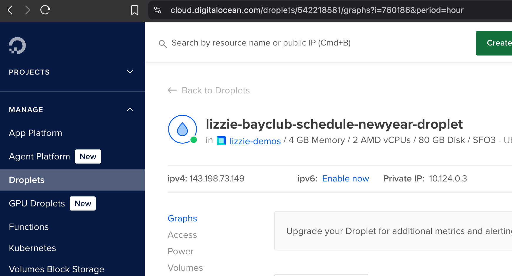

# Auto-book Bay Club San Francisco Ignite classes using Cron on DigitalOcean Droplets

This script runs twice a week to auto-book Bay Club Ignite classes for me via a [DigitalOcean droplet](https://www.digitalocean.com/products/droplets).


### Quickstart
[Create a droplet here](https://cloud.digitalocean.com/droplets). Choose a region (I picked San Francisco). For OS, pick Ubuntu. For version, I did 24.04 (LTS) x64. Basic/regular should be fine. For auth method--pick SSH Key. Give it a hostname, some tags, and click Create Droplet! 

Get YOUR_DROPLET_IP here in the console under ipv4


```bash
# Setup environment
git clone https://github.com/elizabethsiegle/autobook-bayclub-ignite-classes-do.git
cd autobook-bayclub-ignite-classes-do
python3 -m venv env
source env/bin/activate
pip install -r requirements.txt
playwright install chromium
```
That's all local! ssh into your droplet.

## Deployment
1. Upload files to `/bayclub-schedule-ignite` on your droplet.
a. ssh into server: `ssh root@YOUR-DROPLET-IP`
b. `scp -r * root@YOUR-DROPLET-IP:/bayclub-schedule-ignite`
2. install dependencies on the server

```bash
cd /bayclub-schedule-ignite
python3 -m venv env
source env/bin/activate
pip install -r requirements.txt
playwright install chromium
playwright install-deps
```

Install cronjob for whenever you want to book the classes (the code in `app.py` presumes you want to book Wednesday and Thursday Ignite classes at 5:30pm each)

```bash
crontab -e
```

in crontab:
```bash
# Book Wednesdays 530pm class Mon at 5:30pm Mon
30 17 * * 1 cd /bayclub-schedule-ignite && python3 app.py >> /tmp/bayclub.log 2>&1

# Book Thurs 5:30pm at 12:01am Tues
1 0 * * 2 cd /bayclub-schedule-ignite && python3 app.py >> /tmp/bayclub.log 2>&1
```

Run locally with `python3 app.py` to book the classes.
Whenever you edit a file locally, copy it over to the Droplet (from locally):

```bash
scp app.py root@YOUR-DROPLET-IP
```